# Assignments-Manager
---
  The purpose of this project is to make it easier for university/high school students to manage their assignments by logging in with a registered account (or Google) and not only adding, searching, deleting, and updating their assignments on a dedicated page, but also by knowing which assignments need to be submitted in the coming week by the red font date of each assignment to help them plan their time better or in a more convenient way - by Click the Send Email button to send the user the assignments they need to submit in the coming week to their registered email address for on-the-go viewing, as well as learn interesting facts through the different "facts" provided after the dedicated page load. By interacting with AWS QuickSight's dataset to discover factors that may affect their grades or find relationships between other interesting attributes, users can also share the site on Facebook, Linkedin, Twitter and other platforms if they find it interesting. 
--- 
  The project integrates with many AWS services such as Lambda, Elastic Beanstalk, QuickSight, API Gateway, RDS, EC2, S3 and some third party APIs such as Facebook, Linkedin, Twitter, Reddit sharing API, Google authentication API, etc. (See AWS architecture diagram for details).
---
## AWS-System-Architecture-Diagram
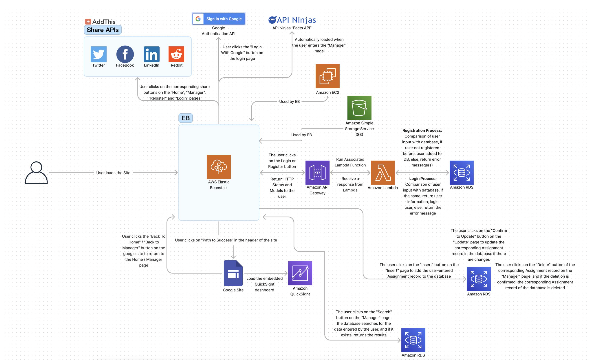
---
## Home Page
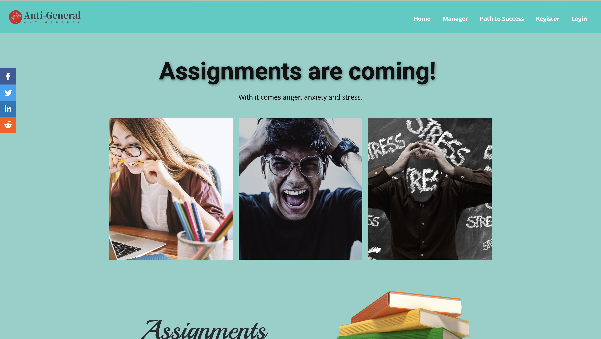
---
## Home Page
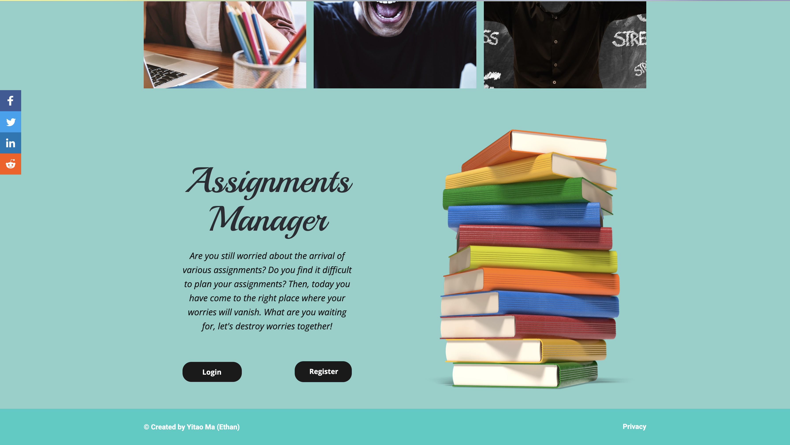
---
## Register Page
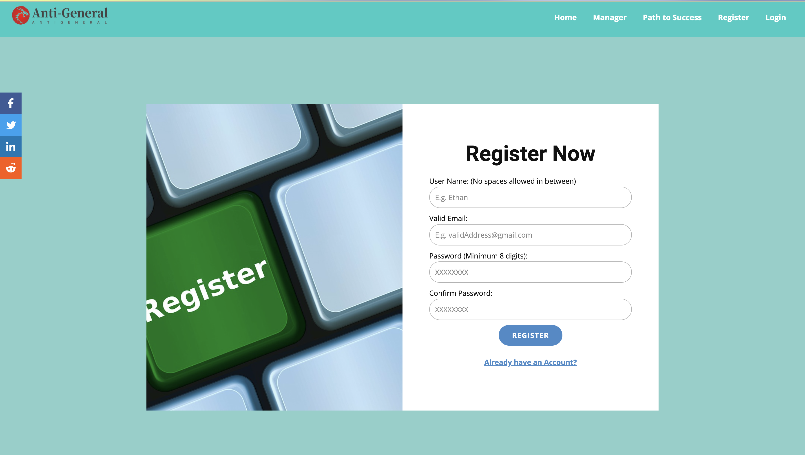
---
## Login Page
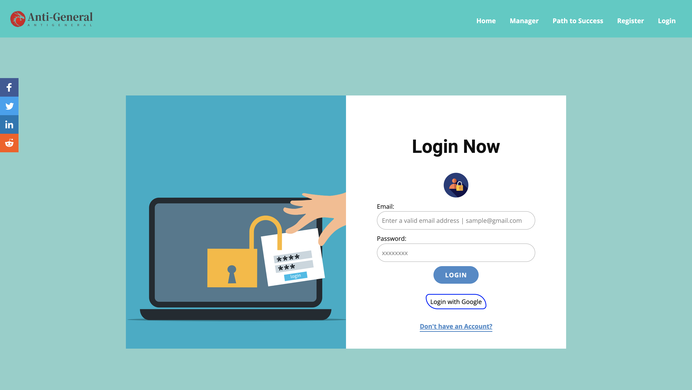
---
## Manager Main Page
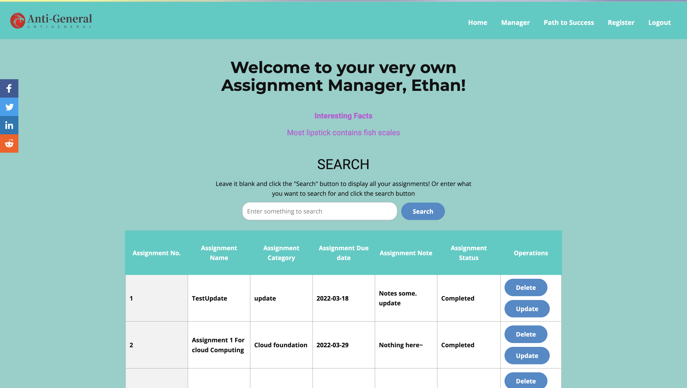
---
## Manager Main Page
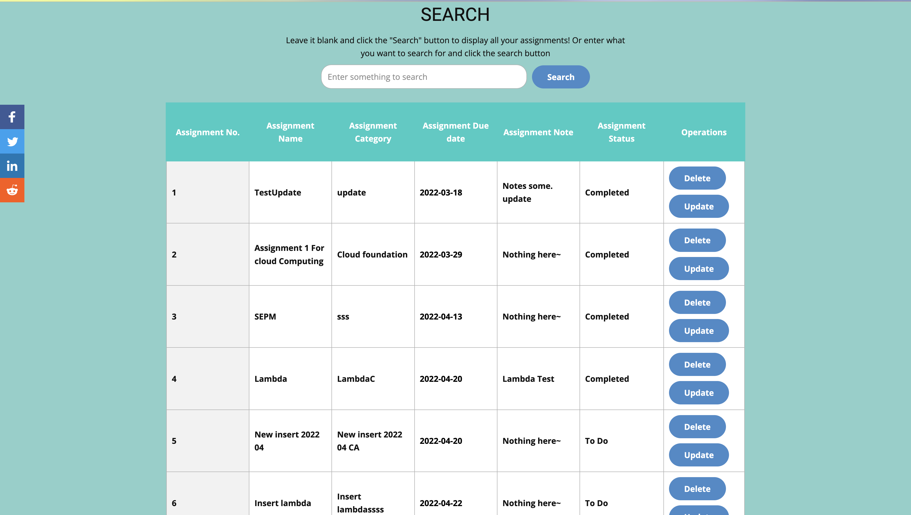
---
## Manager Main Page
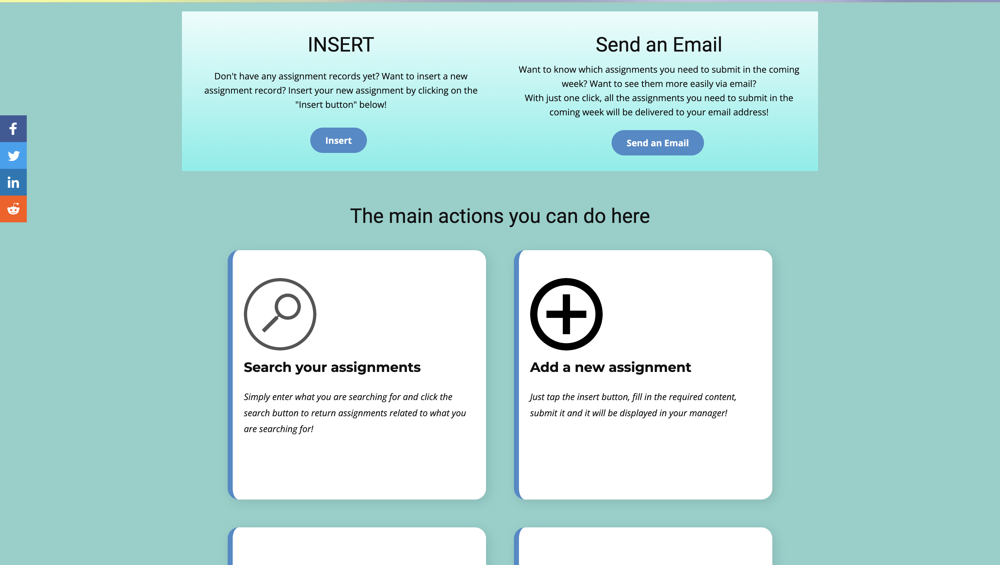
---
## Manager Main Page
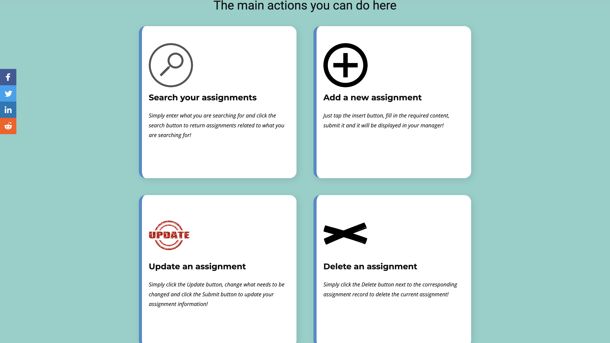
---
## Update Page
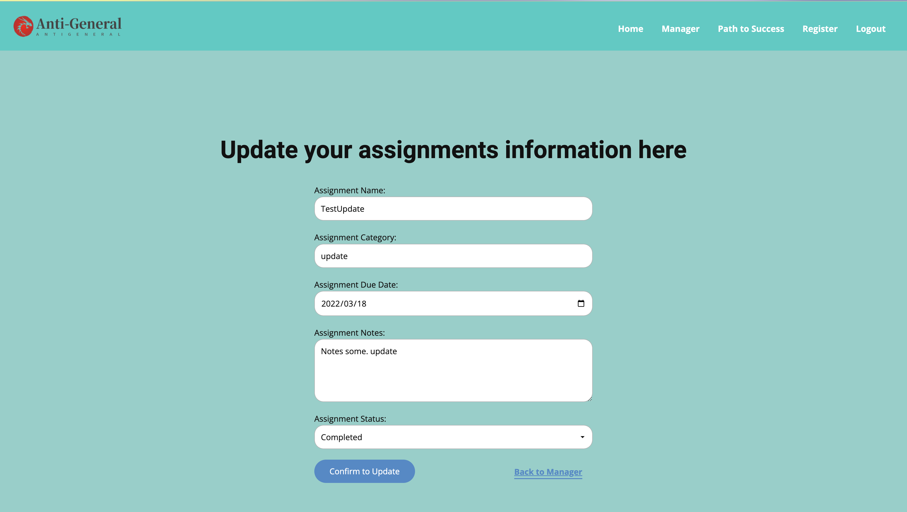
---
## Insert Page
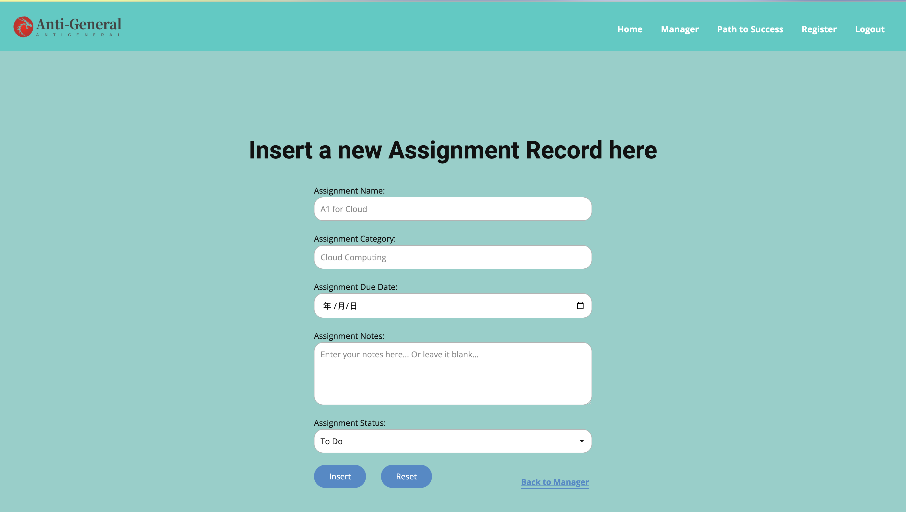
---
## QuickSight Page

---
## QuickSight Page

---
